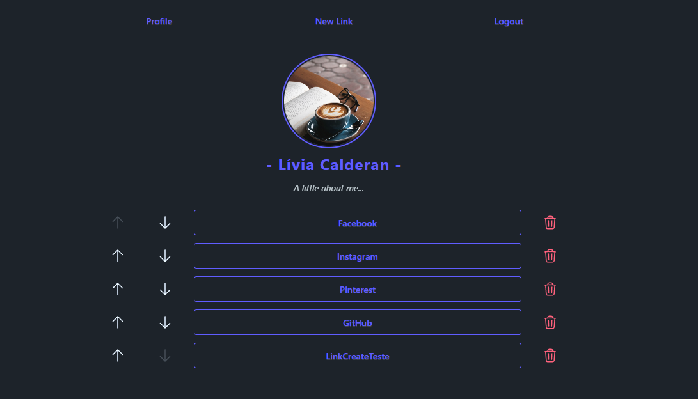
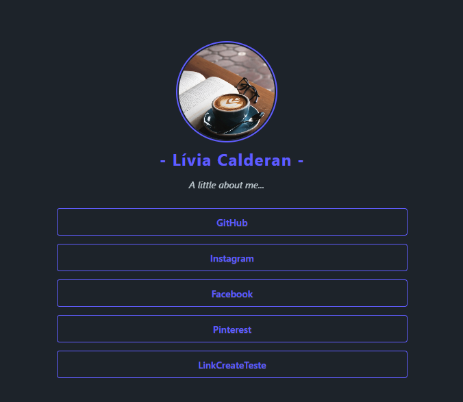
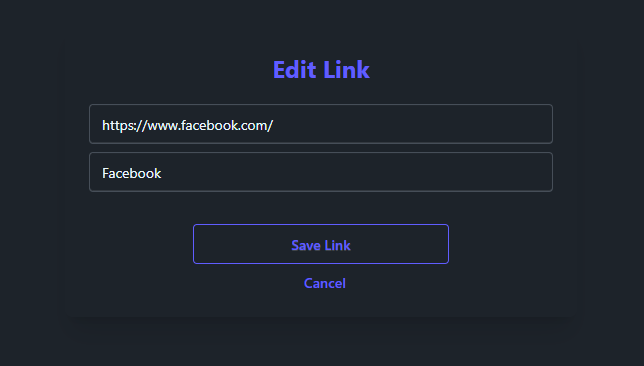
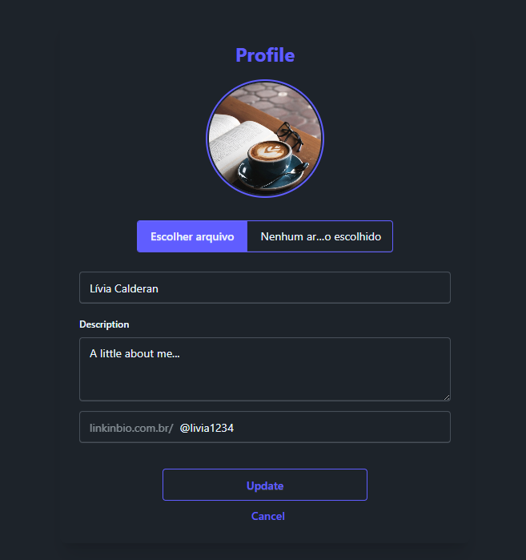

# LinkInBio

Uma plataforma de links pessoais inspirada em páginas de bio, desenvolvida com Laravel.  
O projeto permite criar um perfil personalizado e reunir todos os links importantes em uma única página pública.

## Preview









## Funcionalidades

- Cadastro e autenticação de usuários
- Dashboard privado para gerenciamento do perfil
- Criação, edição e exclusão de links
- Ordenação dos links através de controles de subida e descida
- Página pública personalizada por identificador de usuário
- Perfil com nome, descrição e foto
- Validação de URLs e dados dos formulários
- Controle de autorização para edição dos próprios links
- Interface responsiva com Tailwind CSS e DaisyUI

## Tecnologias

- PHP 8.3+
- Laravel 13
- Laravel Blade
- Tailwind CSS 4
- DaisyUI
- Vite
- SQLite ou outro banco compatível com Laravel
- Pest para testes

## Como executar o projeto

### Requisitos

- PHP 8.3 ou superior
- Composer
- Node.js e npm
- Banco de dados configurado

### Instalação

Clone o repositório:

```bash
git clone https://github.com/SEU-USUARIO/LinkInBio.git
cd biolinks
